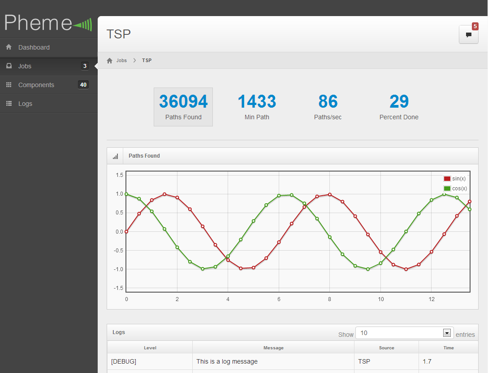

# Pheme
#### Web based admin interface for jPregel

View Pheme's [project page](http://ninj0x.github.com/Pheme/).

### Usage
Pheme is a standard [Play Framework](http://www.playframework.org) web app. To run Pheme, just download the Play Framework file and run:

	play start

in the Pheme root folder.

### Screenshots
Index

Logs

